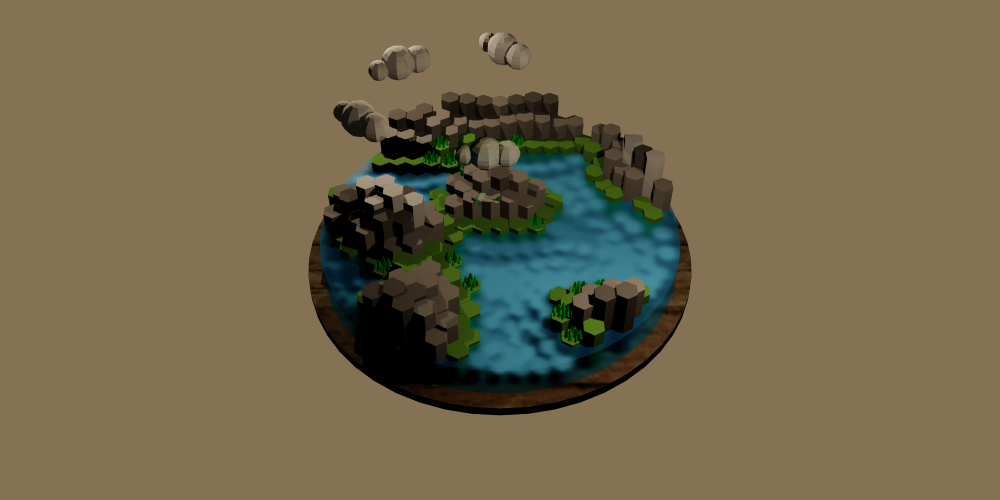

# Procedural Map Generator
[View the live demo](https://3d-map-generator.vercel.app/)
<br>
<br>

<br>

Welcome to my small map generator project! Using Three.js and React, I have created a map generator based on Perlin noise. This generator creates a 3D island made up of a hexgrid, resulting in a unique and visually stunning experience for users.

With this project, users can explore the island from different angles, zoom in and out, and move around the island. The hexgrid structure of the island creates a unique topography that is sure to engage users.

This repository contains all the necessary code and assets for the project, and I welcome contributions from developers and enthusiasts in the Three.js community. Join me in exploring the power of Three.js to create visually stunning web experiences!

## Getting Started
To begin working on this project, you will need to have Node.js installed on your computer. After installing it, you can clone the repository and install its dependencies using npm:

```
git clone https://github.com/DontAskForAnything/3d-map-generator.git
cd 3d-map-generator
npm install
```

After installation, you can start the app using:
```bash
npm start
```
This will launch the website in your default web browser, allowing you to explore the 3D island and its unique topography.